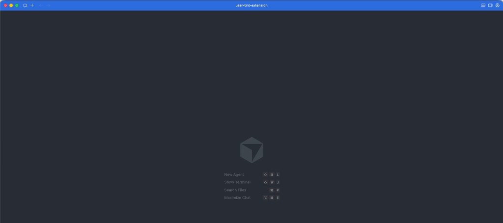
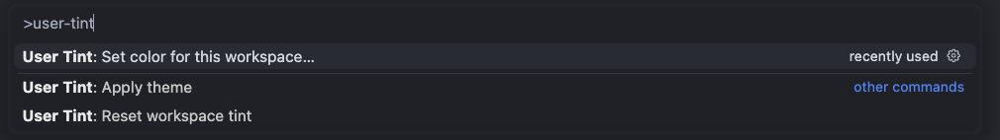
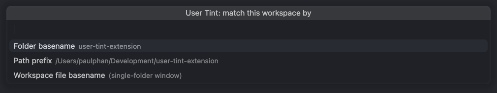
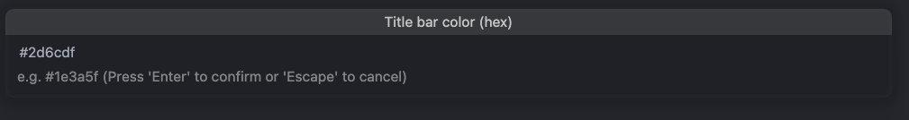

# User Tint

Give each workspace a **distinct title bar** (and optionally the **activity bar**) so you can spot the right window at a glance. Your **matching rules live in user settings**, so they travel with you (Settings Sync) and do not have to be committed to the project.

Works in **Visual Studio Code** and **Cursor**.



## Why this exists (and what makes it different)

**The problem:** I run a lot of folders and workspaces at once. The editor chrome looks the same in every window, so I kept asking *which window is this?* before clicking or pasting somewhere wrong. I wanted a **simple, glanceable** signal tied to *where* I am, not a whole new theme.

**What User Tint does differently:**

- **Your rules live in user settings** (`userTint.rules`, etc.), so they follow you via Settings Sync and are not something every repo has to adopt. You are not asking a team to commit tint colors just so you can navigate locally.
- **Applied colors go to the workspace layer** because that is how VS Code exposes title bar colors. The README below explains how to keep those writes out of a git-tracked folder if you want to.
- **Matchers you actually use** – basename, path prefix, workspace file path, and similar – plus an optional **hash fallback** for “always give me a stable color even when I did not write a rule yet.”
- **Optional workspace overrides** exist if you *do* want shared colors in the repo; they are off unless you allow them.

Other extensions and workflows often push you toward **only** workspace-committed `workbench.colorCustomizations` or **only** global themes. User Tint splits **policy** (your matchers in user settings) from **where the editor stores the resolved colors** (workspace), and documents the tradeoff up front.

## Features

- **User-owned rules** – Path, folder name, or workspace-file matchers; first match wins.
- **Optional hash fallback** – Stable automatic color when no rule matches.
- **Quick setup command** – Pick how to match the workspace and enter a hex color.
- **Optional team colors** – Workspace-level overrides when you explicitly allow them.
- **Reset** – Restore prior title/activity bar colors when possible.

## Install

**From the Marketplace:** search for **User Tint** in the Extensions view and install.

**From a VSIX** (local build or release artifact):

```bash
npm install
npm run compile
npx @vscode/vsce package --no-dependencies
```

Then: **Extensions** → **…** → **Install from VSIX…** and choose `user-tint-*.vsix`.

Or via CLI:

```bash
code --install-extension ./user-tint-1.0.0.vsix
# or
cursor --install-extension ./user-tint-1.0.0.vsix
```

## Quick start

1. Open a **folder** or a **multi-root workspace** (`.code-workspace`).
2. Run **User Tint: Set color for this workspace…** from the Command Palette (`Ctrl+Shift+P` / `Cmd+Shift+P`), or configure **User Tint** in Settings.



3. Choose how this workspace should match (folder name, path prefix, workspace file, etc.).



4. Enter a **title bar** color as hex (foreground is chosen for contrast when you only set a background).



**Other ways to configure**

- Turn on **User Tint › Hash Fallback** for an automatic stable color per workspace.
- Add **User Tint › Rules** in user settings (see example below).
- Run **User Tint: Apply theme** after changing rules, or rely on **User Tint › Auto Apply** (on by default).

## How it works (and one limitation)

The editor only applies colors through `workbench.colorCustomizations`. This extension **writes the resolved colors to the workspace layer** (for example `.vscode/settings.json` for a folder, or your `*.code-workspace` file). There is no supported API for per-window colors that never persist anywhere.

- **Rules and toggles** (`userTint.*`) stay in **user** settings and are not tied to git.
- **The applied colors** are stored with the workspace so each window can look different.

To avoid committing tint colors, open the project through a **user-local** `.code-workspace` file that lives outside the repo (see [Keeping writes out of the repo](#keeping-color-writes-out-of-the-repo)).

## Example `settings.json` (User)

```json
{
  "userTint.autoApply": true,
  "userTint.hashFallback": true,
  "userTint.applyActivityBar": false,
  "userTint.rules": [
    {
      "match": "basename",
      "pattern": "my-api",
      "colors": {
        "titleBarActiveBackground": "#1e4d6b"
      }
    },
    {
      "match": "pathPrefix",
      "pattern": "/Users/you/work/client",
      "colors": {
        "titleBarActiveBackground": "#4a2c6e"
      }
    }
  ]
}
```

### Rule `match` values

| `match`                 | Compares `pattern` to                                 |
| ----------------------- | ------------------------------------------------------ |
| `basename`              | First workspace folder’s directory name                |
| `pathPrefix`            | Normalized path of that folder (prefix match)          |
| `pathContains`          | Substring of that folder path                          |
| `workspaceFilePath`     | Full normalized path of the `.code-workspace` file     |
| `workspaceFileBasename` | Filename of the workspace file (e.g. `foo.code-workspace`) |

**Identity order:** If a workspace **file** is open, that path is used for hashing and for `workspaceFile*` rules; folder rules still use the **first** root folder.

## Keeping color writes out of the repo

Opening `~/code/my-app` as a folder usually stores workspace settings in `my-app/.vscode/settings.json`, which git may track.

**Pattern that avoids repo changes:** create a `.code-workspace` file **outside** the clone, for example under your editor user directory:

```json
{
  "folders": [{ "path": "/absolute/path/to/my-app" }],
  "settings": {}
}
```

Open that workspace file in the editor. User Tint can persist `workbench.colorCustomizations` **in that file** instead of inside the project folder.

## Optional team overrides (in the repo)

1. Set **User Tint › Allow Workspace Override** to `true` in user settings.
2. Commit **workspace** settings with `userTint.workspaceColors` (same keys as rule `colors`: `titleBarActiveBackground`, etc.).

Overrides merge on top of your user rules for that workspace.

## Commands

| Command                                      | Action                                                                 |
| -------------------------------------------- | ---------------------------------------------------------------------- |
| **User Tint: Set color for this workspace…** | Choose match type and hex; adds a user rule and applies                |
| **User Tint: Apply theme**                   | Re-resolve rules and write workspace colors                            |
| **User Tint: Reset workspace tint**          | Remove this extension’s title/activity keys; restore prior when possible |

## Development

```bash
npm install
npm run compile   # or npm run watch
npm test          # Vitest (resolution logic)
```

**Run the extension:** open this repo in VS Code or Cursor → **Run and Debug** → **Run Extension** (F5).

## Publishing

Targets the [Visual Studio Marketplace](https://marketplace.visualstudio.com/) (VS Code, Cursor, and compatible editors). Official guide: [Publishing extensions](https://code.visualstudio.com/api/working-with-extensions/publishing-extension).

**One-time:** Create a [publisher](https://marketplace.visualstudio.com/manage), create an Azure DevOps **Personal Access Token** with **Marketplace → Manage**, then:

```bash
npx @vscode/vsce login <your-publisher-id>
```

**Each release:** Bump `"version"` in `package.json`, ensure `"publisher"` matches your marketplace id, then:

```bash
npm test
npm run compile
npx @vscode/vsce publish --no-dependencies
```

**Package only (no upload):** `npx @vscode/vsce package --no-dependencies` produces `user-tint-<version>.vsix`.

README screenshots live under `media/` so they ship in the VSIX and resolve on the marketplace listing.

**Common issues:** `403` / unauthorized → PAT scope or publisher mismatch. Duplicate version → bump `package.json`. **License:** this repo includes `LICENSE` (MIT); `vsce` includes it in the package.

**Open VSX** (VSCodium, some mirrors) is a separate registry; see [Open VSX publishing](https://github.com/eclipse/openvsx/wiki/Publishing-Extensions).

## Privacy

Rules and preferences are normal VS Code **user** and **workspace** settings, plus extension **workspace state** (a snapshot of previous colors for reset). **No data is sent to external servers.**

## Upgrading from older local builds

If you previously used a VSIX named `project-chrome`, uninstall it and install **User Tint**. Settings moved from `projectChrome.*` to `userTint.*`; copy rules over manually if needed.
