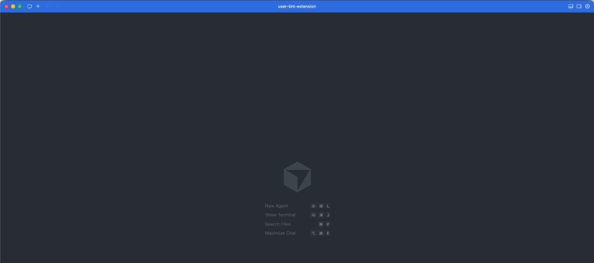
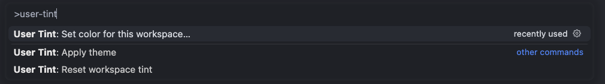
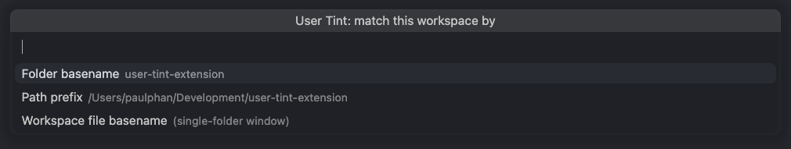
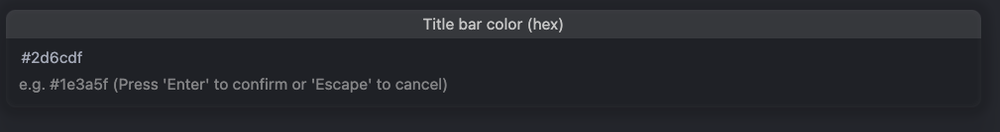

# User Tint

Give each workspace a **distinct title bar** (and optionally the **activity bar**) so you can spot the right window at a glance. Your **matching rules live in user settings**, so they travel with you (Settings Sync) and do not have to be committed to the project.

Works in **Visual Studio Code** and **Cursor**.

Release notes: [`CHANGELOG.md`](CHANGELOG.md).



## Why this exists (and what makes it different)

**The problem:** On team or client repos, **`.vscode/` is often in git**. A lot of extensions that “configure this workspace” save **workspace-scoped** settings into `.vscode/settings.json` (or your `.code-workspace` file). That is normal VS Code behavior, not something those extensions invented, but it means **personal UI choices** (like title bar colors) can show up as **shared diffs**, or you end up choosing between **git noise** and **asking everyone** to accept your tint. You usually **cannot** treat `.vscode` as “only mine” on a repo the whole team uses.

On top of that, I run many folders and workspaces at once: same-looking chrome everywhere made me ask *which window is this?* before clicking or pasting in the wrong place. I wanted a **simple, glanceable** signal tied to *where* I am, not a whole new theme.

**What User Tint does differently:**

- **Your rules live in user settings** (`userTint.rules`, etc.), so they follow you via Settings Sync and are **not** something every repo has to adopt. Matchers and toggles are yours; you are not forcing teammates to use your colors just to work in the tree.
- **Applied colors still go to the workspace layer** because that is the only supported way VS Code applies title bar colors. The README below explains how to keep those writes **out of a git-tracked clone** (for example a user-local `.code-workspace` that points at the repo) when you want zero footprint in the client’s `.vscode`.
- **Matchers you actually use** – basename, path prefix, workspace file path, and similar – plus an optional **hash fallback** for “always give me a stable color even when I did not write a rule yet.”
- **Optional workspace overrides** exist if you *do* want shared colors in the repo; they are off unless you allow them.

**About “other extensions”:** Not every extension touches `.vscode`; many only use **user** settings or internal storage. But extensions that persist **workspace** settings for a folder almost always land in **`.vscode/settings.json`** when that is where the workspace lives, which is why tint-style tools commonly conflict with **shared, committed** editor config. User Tint keeps **policy** in **user** settings and documents how **resolved colors** (workspace) can stay off the repo when you need that.

## Features

- **User-owned rules** – Path, folder name, or workspace-file matchers; first match wins.
- **Optional hash fallback** – Stable automatic color when no rule matches.
- **Quick setup command** – Pick how to match the workspace, choose a **Flat UI** preset or enter a custom hex color.
- **Optional team colors** – Workspace-level overrides when you explicitly allow them.
- **Workspace write mode** – Prefer applying only when a `.code-workspace` file is open, or disable workspace writes entirely, so you can keep tint colors out of a repo’s `.vscode/settings.json` (see **User Tint › Workspace Write Mode**).
- **Reset** – Restore prior title/activity bar colors when possible.

## Install

**From the Marketplace:** search for **User Tint** in the Extensions view and install.

**From a VSIX** (local build or release artifact):

```bash
npm install
npm run compile
npx @vscode/vsce package --no-dependencies
```

Then: **Extensions** → **…** → **Install from VSIX…** and choose `user-tint-*.vsix`.

Or via CLI:

```bash
code --install-extension ./user-tint-<version>.vsix
# or
cursor --install-extension ./user-tint-<version>.vsix
```

## Quick start

1. Open a **folder** or a **multi-root workspace** (`.code-workspace`).
2. Run **User Tint: Set color for this workspace…** from the Command Palette (`Ctrl+Shift+P` / `Cmd+Shift+P`), or configure **User Tint** in Settings.



3. Choose how this workspace should match (folder name, path prefix, workspace file, etc.).



4. Pick a **Flat UI** preset (color swatch on the left) or type a hex. The **title bar previews live** as you move through the list; confirm on the last step.



The title bar updates immediately when **User Tint › Auto Apply** is on (default).

## Recommended user settings

For title bar tints that **show up**, **stay visible when the window is unfocused**, and **re-apply automatically**, add this to your **User** `settings.json`:

```json
{
  "window.titleBarStyle": "custom",
  "userTint.autoApply": true,
  "userTint.workspaceWriteMode": "workspace",
  "userTint.rules": []
}
```

| Setting | Why |
| ------- | --- |
| **`window.titleBarStyle`: `"custom"`** | Required on macOS and many Cursor setups. A **native** title bar ignores `workbench.colorCustomizations`. Reload after changing. |
| **`userTint.autoApply`: `true`** | Re-applies your rules when you open or switch workspaces (default). |
| **`userTint.workspaceWriteMode`: `"workspace"`** | Writes tint colors for normal folder workspaces. Use `workspaceFileOnly` only if you open repos via a user-local `.code-workspace` file and want zero `.vscode` writes (see [Keeping writes out of the repo](#keeping-color-writes-out-of-the-repo)). |

User Tint maps each rule color to **four** workbench keys so the tint does not vanish when another app or window is focused:

- `titleBar.activeBackground` / `titleBar.activeForeground`
- `titleBar.inactiveBackground` / `titleBar.inactiveForeground`

You only set `titleBarActiveBackground` in rules; foreground and inactive variants are filled in automatically.

**Other ways to configure**

- Turn on **User Tint › Hash Fallback** for an automatic stable color per workspace.
- Add **User Tint › Rules** in user settings (see example below).
- Set **User Tint › Workspace Write Mode** to **`workspaceFileOnly`** when you open repos via a user-local `.code-workspace` file and want to avoid writes under the clone’s `.vscode/` (see [Keeping writes out of the repo](#keeping-color-writes-out-of-the-repo)).
- Run **User Tint: Apply theme** after changing rules, or rely on **User Tint › Auto Apply** (on by default).

## How it works (and one limitation)

The editor only applies colors through `workbench.colorCustomizations`. This extension **writes the resolved colors to the workspace layer** (for example `.vscode/settings.json` for a folder, or your `*.code-workspace` file). There is no supported API for per-window colors that never persist anywhere.

- **Rules and toggles** (`userTint.*`) stay in **user** settings and are not tied to git.
- **The applied colors** are stored with the workspace so each window can look different.

To avoid committing tint colors, open the project through a **user-local** `.code-workspace` file that lives outside the repo (see [Keeping writes out of the repo](#keeping-color-writes-out-of-the-repo)), and consider **`workspaceFileOnly`** so User Tint does not apply (or warn) when you accidentally open the folder directly.

## Example `settings.json` (User)

```json
{
  "window.titleBarStyle": "custom",
  "userTint.autoApply": true,
  "userTint.hashFallback": false,
  "userTint.applyActivityBar": false,
  "userTint.workspaceWriteMode": "workspace",
  "userTint.rules": [
    {
      "match": "basename",
      "pattern": "my-api",
      "colors": {
        "titleBarActiveBackground": "#1e4d6b"
      }
    },
    {
      "match": "pathPrefix",
      "pattern": "/Users/you/work/client",
      "colors": {
        "titleBarActiveBackground": "#4a2c6e"
      }
    }
  ]
}
```

### Rule `match` values

| `match`                 | Compares `pattern` to                                 |
| ----------------------- | ------------------------------------------------------ |
| `basename`              | First workspace folder’s directory name                |
| `pathPrefix`            | Normalized path of that folder (prefix match)          |
| `pathContains`          | Substring of that folder path                          |
| `workspaceFilePath`     | Full normalized path of the `.code-workspace` file     |
| `workspaceFileBasename` | Filename of the workspace file (e.g. `foo.code-workspace`) |

**Identity order:** If a workspace **file** is open, that path is used for hashing and for `workspaceFile*` rules; folder rules still use the **first** root folder.

## Keeping color writes out of the repo

Opening `~/code/my-app` as a folder usually stores workspace settings in `my-app/.vscode/settings.json`, which git may track.

**Pattern that avoids repo changes:** create a `.code-workspace` file **outside** the clone, for example under your editor user directory:

```json
{
  "folders": [{ "path": "/absolute/path/to/my-app" }],
  "settings": {}
}
```

Open that workspace file in the editor. User Tint can persist `workbench.colorCustomizations` **in that file** instead of inside the project folder.

## Optional team overrides (in the repo)

1. Set **User Tint › Allow Workspace Override** to `true` in user settings.
2. Commit **workspace** settings with `userTint.workspaceColors` (same keys as rule `colors`: `titleBarActiveBackground`, etc.).

Overrides merge on top of your user rules for that workspace.

## What each command does

| Command | When to use |
| ------- | ----------- |
| **Set color for this workspace…** | First-time setup (or change color). Saves a **user rule** and applies the tint. |
| **Apply theme** | Re-run your rules after editing `userTint.rules` in settings, or when **Auto Apply** is off. |
| **Reset workspace tint** | Remove applied title/activity bar colors in **this workspace** and restore what you had before. Does not delete your user rules. |

## Flat UI presets

When you run **Set color for this workspace…**, **Custom hex…** is listed first. Type a hex in the picker (e.g. `#3498db`) and press Enter to use it even when no preset matches, or pick from [Flat UI](https://flatuicolors.com/):

| Name | Hex | Name | Hex |
| ---- | --- | ---- | --- |
| Turquoise | `#1abc9c` | Green Sea | `#16a085` |
| Emerald | `#2ecc71` | Nephritis | `#27ae60` |
| Peter River | `#3498db` | Belize Hole | `#2980b9` |
| Amethyst | `#9b59b6` | Wisteria | `#8e44ad` |
| Wet Asphalt | `#34495e` | Midnight Blue | `#2c3e50` |
| Sun Flower | `#f1c40f` | Orange | `#f39c12` |
| Carrot | `#e67e22` | Pumpkin | `#d35400` |
| Alizarin | `#e74c3c` | Pomegranate | `#c0392b` |
| Concrete | `#95a5a6` | Asbestos | `#7f8c8d` |

Very light Flat UI neutrals (Clouds, Silver) are omitted because they read poorly on title bars.

## Commands

| Command                                      | Action                                                                 |
| -------------------------------------------- | ---------------------------------------------------------------------- |
| **User Tint: Set color for this workspace…** | Match type, Flat UI preset or custom hex; adds a user rule and applies |
| **User Tint: Apply theme**                   | Re-resolve rules and write workspace colors                            |
| **User Tint: Reset workspace tint**          | Remove this extension’s title/activity keys; restore prior when possible |

## Troubleshooting

See [Recommended user settings](#recommended-user-settings) first.

### Title bar color did not change

User Tint sets `workbench.colorCustomizations` for the **title bar** (top window chrome), not the editor tabs or status bar.

**Most common cause:** **User Tint › Workspace Write Mode** is `workspaceFileOnly` (or `never`) but you opened a **folder**, not a `.code-workspace` file. Rules save to user settings, but colors are not written. Run **Apply theme** and choose **Use workspace mode**, or open the project via a user-local `.code-workspace` file.

On **macOS** and some **Cursor** setups, the OS uses a **native** title bar that ignores theme colors. Set this in **User** settings:

```json
{
  "window.titleBarStyle": "custom"
}
```

Reload the window after changing it. User Tint will offer to enable this the first time it applies a tint.

**Tint disappears when you click another window:** fixed in v1.0.13+ — User Tint now sets both **active** and **inactive** title bar colors. Re-run **Apply theme** after upgrading.

**Activity bar** (left icon strip) only changes when **User Tint › Apply Activity Bar** is enabled.

### Rule saved but no tint

- Confirm a folder or `.code-workspace` is open.
- Check **User Tint › Workspace Write Mode** if you use `workspaceFileOnly` or `never`.
- Run **User Tint: Apply theme** if **Auto Apply** is off.
- Search settings for `@ext:ImpactSix.user-tint` to confirm your rule exists.

## Development

```bash
pnpm install    # or npm install
pnpm compile    # or npm run watch
pnpm test
pnpm package:vsix   # builds dist/user-tint-<version>.vsix
```

**Run the extension:** open this repo in VS Code or Cursor → **Run and Debug** → **Run Extension** (F5).

## Publishing

Targets the [Visual Studio Marketplace](https://marketplace.visualstudio.com/) (VS Code, Cursor, and compatible editors). Official guide: [Publishing extensions](https://code.visualstudio.com/api/working-with-extensions/publishing-extension).

**One-time:** Create a [publisher](https://marketplace.visualstudio.com/manage), create an Azure DevOps **Personal Access Token** with **Marketplace → Manage**, then:

```bash
npx @vscode/vsce login <your-publisher-id>
```

**Each release:** Bump `"version"` in `package.json`, add a **`## [x.y.z]`** section to **`CHANGELOG.md`** (required), ensure `"publisher"` matches your marketplace id, then:

```bash
npm test
npm run compile
npm run verify-changelog
npx @vscode/vsce publish --no-dependencies
```

`vscode:prepublish` runs `verify-changelog`, so packaging also fails if the changelog does not document the current version. CI and the release workflow run the same check.

**Package only (no upload):** `pnpm package:vsix` (or `npm run package:vsix`) writes `dist/user-tint-<version>.vsix`.

README screenshots live under `media/` so they ship in the VSIX and resolve on the marketplace listing.

**Common issues:** `403` / unauthorized → PAT scope or publisher mismatch. Duplicate version → bump `package.json`. **License:** this repo includes `LICENSE` (MIT); `vsce` includes it in the package.

**Open VSX** (VSCodium, some mirrors) is a separate registry; see [Open VSX publishing](https://github.com/eclipse/openvsx/wiki/Publishing-Extensions).

## Privacy

Rules and preferences are normal VS Code **user** and **workspace** settings, plus extension **workspace state** (a snapshot of previous colors for reset). **No data is sent to external servers.**

## Upgrading from older local builds

If you previously used a VSIX named `project-chrome`, uninstall it and install **User Tint**. Settings moved from `projectChrome.*` to `userTint.*`; copy rules over manually if needed.

If you upgraded from **before 1.0.13**, run **User Tint: Apply theme** once so **inactive** title bar colors are written (fixes tint disappearing when the window loses focus).
